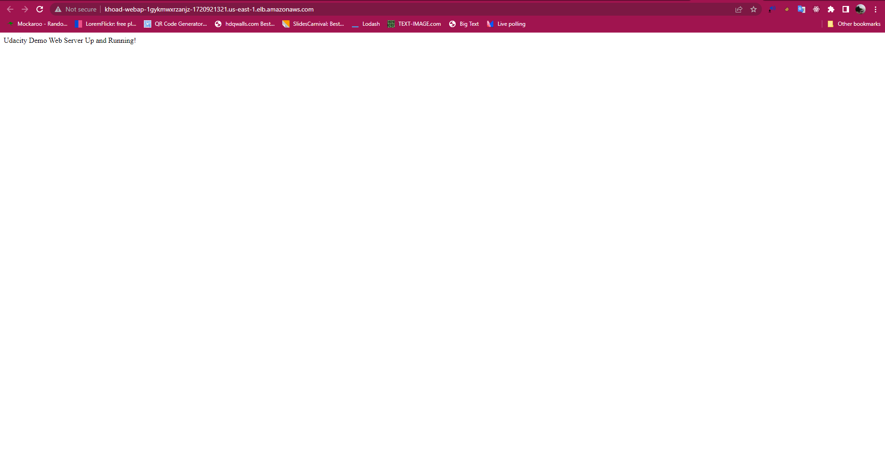

# DevOps Project 2

## How to run

### Create VPC Network

> ./create.sh vpc-stack vpc.yaml vpc-parameters.yaml

### Create Server

> ./create.sh server-stack server.yaml server-parameters.yaml

### Link DNS LB

> http://khoad-webap-1gykmwxrzanjz-1720921321.us-east-1.elb.amazonaws.com/

